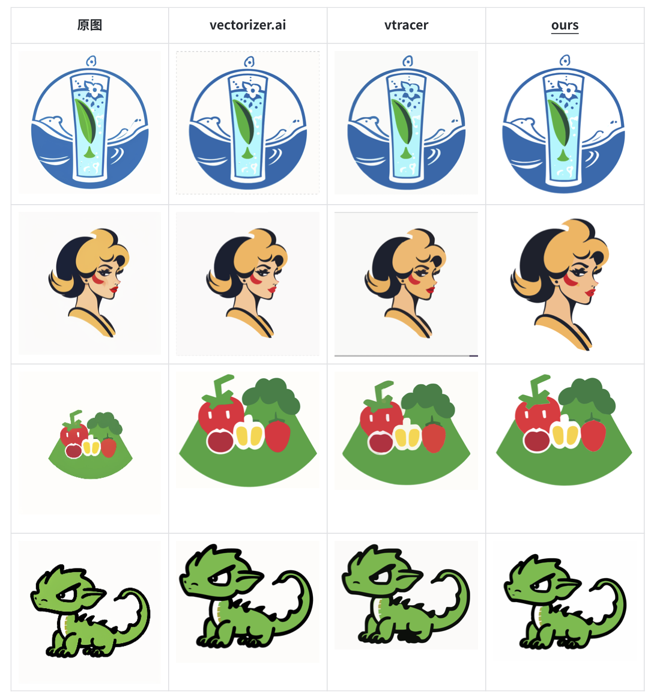

# PNG2SVG

[![CC BY-NC-SA 4.0][cc-by-nc-sa-shield]][cc-by-nc-sa]

Convert images from png/jpg format to svg.

Star is all I need, please star it if it's a little bit helpful for you :)


## Performance Compare

In some cases our algorithm is more accurate in detailes compare to some popular repo.




## Install

Clone repo.

```shell
# Use whole functions with sr, highly recommand
git clone --recursive https://github.com/zoezhu/png2svg.git

# OR
# Do not use sr, no need to install torch and Real-ESRGAN, with performance degradation
git clone https://github.com/zoezhu/png2svg.git
```


- Regular library

  ```shell
  pip install -r requirements.txt
  ```

- Potrace

  Ubuntu:

  ```shell
  # install system dependencies
  sudo apt-get install build-essential python-dev libagg-dev libpotrace-dev pkg-config
  
  # Install pypotrace
  cd pypotrace
  pip install numpy
  pip install .
  cd ..
  ```

  CentOS/OSX/Windows install steps can be found in [Potrace](https://pypi.org/project/pypotrace/) site.

- Real-ESRGAN (highly recommend)

  ```shell
  cd Real-ESRGAN
  pip install basicsr
  # facexlib and gfpgan are for face enhancement
  pip install facexlib
  pip install gfpgan
  pip install -r requirements.txt
  python setup.py develop
  ```

  Install [torch](https://pytorch.org/) with corresponding version of your machine.

  ```shell
  # default install, please check your machine and choose right version
  pip3 install torch
  ```

  Download model file.

  ```shell
  # Make sure under Real-ESRGAN folder
  # RealESRGAN_x4plus_anime_6B.pth, good for anime style input
  wget https://github.com/xinntao/Real-ESRGAN/releases/download/v0.2.2.4/RealESRGAN_x4plus_anime_6B.pth -P weights
  # RealESRGAN_x4plus.pth
  wget https://github.com/xinntao/Real-ESRGAN/releases/download/v0.1.0/RealESRGAN_x4plus.pth -P weights
  ```

  

## Usage

Input path can be a file or a folder.

```text
Usage: python get_svg.py
-f   file       required=True, type=str, Input image folder or single image path.
-c   color      type=int, default=-1, How many colors you want to draw.
-sr  do_sr      Wheather do super resolution for input image.
```

Run the script.

```shell
# Use sr to make better performance
python get_svg.py -f test_img/test.png -sr

# OR
# Do not use sr
python get_svg.py -f test_img/test.png
```

Output svg file is under the same path as input file, with the same name but suffix is “svg”.


## License

This work is licensed under a [Creative Commons Attribution-NonCommercial-ShareAlike 4.0 International License][cc-by-nc-sa].


[![CC BY-NC-SA 4.0][cc-by-nc-sa-image]][cc-by-nc-sa]

[cc-by-nc-sa]: http://creativecommons.org/licenses/by-nc-sa/4.0/
[cc-by-nc-sa-image]: https://licensebuttons.net/l/by-nc-sa/4.0/88x31.png
[cc-by-nc-sa-shield]: https://img.shields.io/badge/License-CC%20BY--NC--SA%204.0-lightgrey.svg


PNG2SVG © 2023 by zoezhu is licensed under CC BY-NC-SA 4.0 


